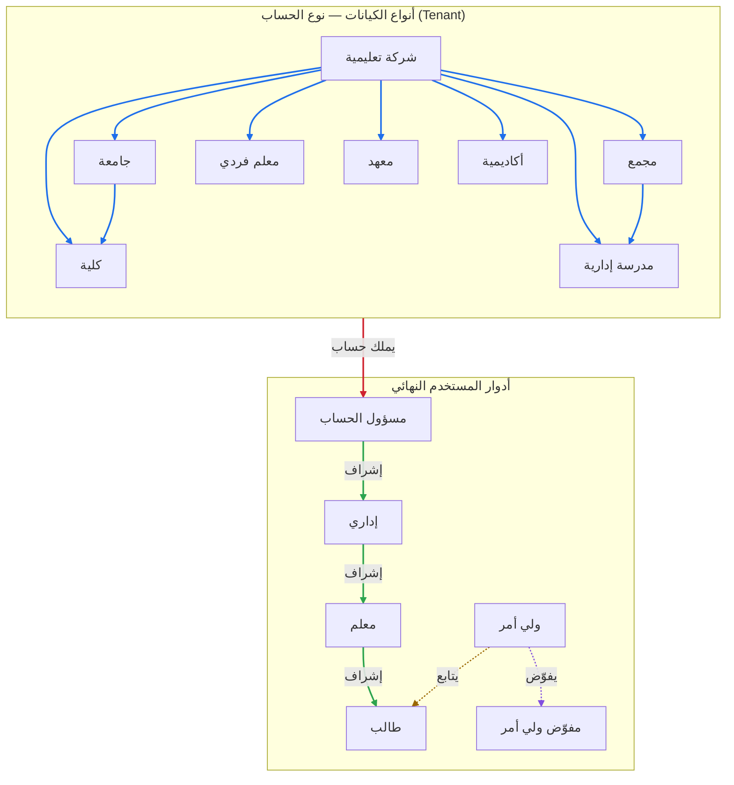

# خريطة الأدوار وأنواع الحسابات

خريطة موجَّهة تربط **أنواع الكيانات (Tenant — نوع الحساب)** بـ**أدوار المستخدم
النهائي**، وتوضّح علاقات «متبوع → تابع» بمختلف دلالاتها.

- أنواع الكيانات: [`tenants.md`](tenants.md)
- أدوار المستخدم النهائي: [`end-users.md`](end-users.md)

> اقرأ السهم: **العقدة المتبوعة → العقدة التابعة**. نوع العلاقة مكتوب على السهم،
> وأنماط/ألوان الأسهم تميّز الدلالات (انظر مفتاح الرموز أسفل المخطط).

## المخطط

## مفتاح الرموز

| النمط | الدلالة | مثال |
|---|---|---|
| سهم سميك أزرق (`==>`) | **احتواء**: نوع كيان يحتوي/يدير نوعًا أصغر | شركة تعليمية → جامعة، جامعة → كلية، مجمع → مدرسة إدارية |
| سهم سميك أحمر (`==>`) | **ملكية حساب**: أي نوع كيان يملك «مسؤول الحساب» | نوع الحساب → مسؤول الحساب |
| سهم صلب أخضر (`-->`) | **إشراف هرمي** بين الأدوار | مسؤول الحساب → إداري → معلم → طالب |
| سهم منقّط أصفر (`-.->`) | **متابعة** | ولي أمر → طالب |
| سهم منقّط بنفسجي (`-.->`) | **تفويض** صلاحيات | ولي أمر → مفوّض ولي أمر |

## ملاحظات

- **شركة تعليمية** هي الحاوية الأعلى: تضمّ أي نوع من الأنواع السابقة، لذلك تتفرّع
  منها أسهم احتواء إلى الأنواع كافة.
- نوعٌ كيان قد يظهر تحت أكثر من حاوية (مثلًا **كلية** تتبع **شركة تعليمية**
  مباشرة أو تحت **جامعة**)، وهذا يُمثَّل بأسهم احتواء متعددة.
- علاقات الأدوار (إشراف/متابعة/تفويض) تجري **داخل** نطاق نوع الحساب الواحد، إذ يملك
  كل كيان «مسؤول الحساب» الذي ينطلق منه التسلسل الإداري.
