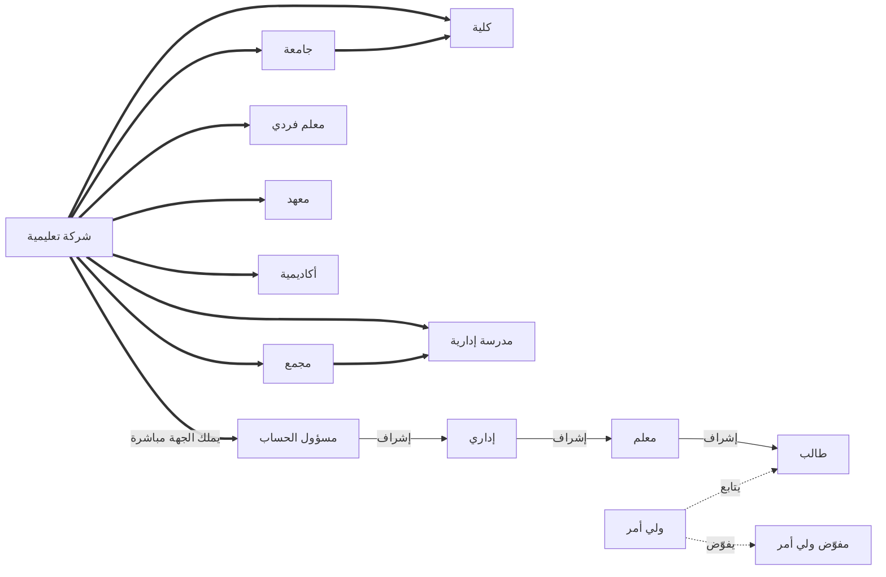

# خريطة الأدوار وأنواع الحسابات

خريطة موجَّهة تربط **أنواع الكيانات (Tenant — نوع الحساب)** بـ**أدوار المستخدم
النهائي**، وتوضّح علاقات «متبوع → تابع» بمختلف دلالاتها.

- أنواع الكيانات: [`tenants.md`](tenants.md)
- أدوار المستخدم النهائي: [`end-users.md`](end-users.md)

> اقرأ كل علاقة بصيغة **متبوع → تابع**.

## شجرة احتواء الكيانات

نوع الكيان الأعلى يحتوي ما تحته. **شركة تعليمية** هي الحاوية العليا التي تضمّ أي
نوع من الأنواع الأخرى:

- **شركة تعليمية**
  - **جامعة** → تحتوي **كلية**
  - **مجمع** → يحتوي **مدرسة إدارية**
  - **كلية** (مباشرة)
  - **مدرسة إدارية** (مباشرة)
  - **معلم فردي**
  - **معهد**
  - **أكاديمية**

أيُّ نوع كيان قد يقف مستقلًّا (مثل **كلية** تتبع الشركة مباشرة، أو تحت **جامعة**).

## مالك الجهة والتسلسل الإداري

**مسؤول الحساب = المالك المباشر للجهة (الكيان).** لكل كيان تعليمي مسؤولُ حسابٍ
واحد يملكه مباشرةً، ومنه ينطلق الإشراف الهرمي داخل الجهة:

- **مسؤول الحساب** (المالك المباشر) → **إداري** → **معلم** → **طالب**
- **ولي أمر** → **طالب** (علاقة متابعة)
- **ولي أمر** → **مفوّض ولي أمر** (تفويض صلاحيات)

## جدول العلاقات

| المتبوع | → | التابع | نوع العلاقة |
|---|---|---|---|
| شركة تعليمية | → | جامعة / مجمع / كلية / مدرسة إدارية / معلم فردي / معهد / أكاديمية | احتواء كيان |
| جامعة | → | كلية | احتواء كيان |
| مجمع | → | مدرسة إدارية | احتواء كيان |
| نوع الكيان (أي نوع) | → | مسؤول الحساب | ملكية مباشرة للجهة |
| مسؤول الحساب | → | إداري | إشراف هرمي |
| إداري | → | معلم | إشراف هرمي |
| معلم | → | طالب | إشراف هرمي |
| ولي أمر | → | طالب | متابعة |
| ولي أمر | → | مفوّض ولي أمر | تفويض |

## مخطط (اختياري للعارض)

نمط الخط يميّز الدلالة: سميك (`==>`) احتواء/ملكية، صلب (`-->`) إشراف،
منقّط (`-.->`) متابعة/تفويض.

