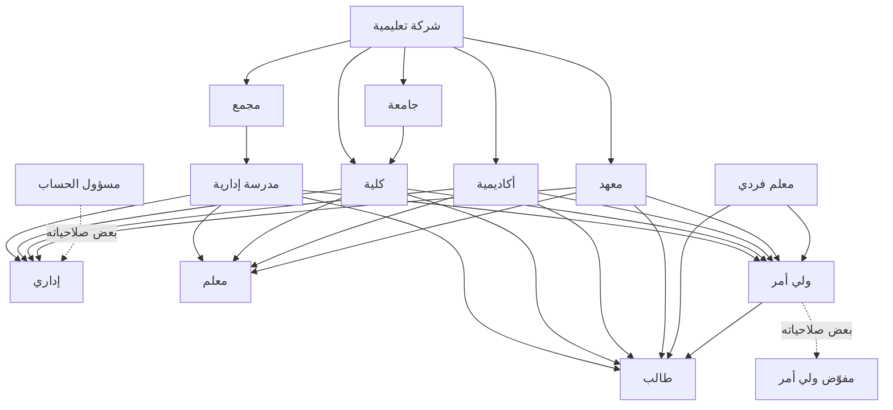

# خريطة الأدوار وأنواع الحسابات

خريطة موجَّهة تربط **أنواع الكيانات (Tenant — نوع الحساب)** بـ**أدوار المستخدم
النهائي**، وتوضّح علاقات «متبوع → تابع».

- أنواع الكيانات: [`tenants.md`](tenants.md)
- أدوار المستخدم النهائي: [`end-users.md`](end-users.md)

> اقرأ كل علاقة بصيغة **متبوع → تابع**.
> **مسؤول الحساب = المالك المباشر للجهة (الكيان)**: كل جهة تشغيلية يملكها مسؤولُ
> حسابٍ مباشرةً، ومن خلالها تُدار الأدوار الظاهرة أدناه.

## التسلسل

**حاويات (لا تضمّ مستخدمين مباشرةً، بل جهات أصغر):**

- **شركة تعليمية** (الحاوية العليا) تحتوي:
  - **مجمع** → يحتوي **مدرسة إدارية**
  - **جامعة** → تحتوي **كلية**
  - **أكاديمية**
  - **معهد**
  - **كلية** (قد تتبع الشركة مباشرةً أو تحت جامعة)

**جهات تشغيلية (تملكها مسؤول حساب، وتدير المستخدمين):**

- **مدرسة إدارية** / **كلية** / **أكاديمية** / **معهد** — كلٌّ منها يدير:
  **إداري**، **معلم**، **ولي أمر**، **طالب**.
- **معلم فردي** (جهة مستقلّة) — يدير: **ولي أمر**، **طالب** فقط.

**داخل الأدوار:**

- **ولي أمر** → **طالب** (علاقة متابعة).

## اشتقاق الأدوار بالصلاحيات

بعض الأدوار **تُشتقّ** من دورٍ أعلى بمنحه جزءًا من صلاحياته (تفويض جزئي)، لا بإنشاء
نوع مستقلّ:

- **مسؤول الحساب → إداري**: يشتقّ مسؤولُ الحساب دورَ **إداري** بمنحه **بعض**
  صلاحياته لإدارة العمليات اليومية للجهة، دون منحه كامل ملكية الحساب.
- **ولي أمر → مفوّض ولي أمر**: يشتقّ وليُّ الأمر **مفوّضًا** بمنحه **بعض** صلاحياته
  على الطالب وفق ما يحدّده له.

## جدول العلاقات

| المتبوع | → | التابع | نوع العلاقة |
|---|---|---|---|
| شركة تعليمية | → | مجمع / جامعة / أكاديمية / كلية / معهد | احتواء كيان |
| مجمع | → | مدرسة إدارية | احتواء كيان |
| جامعة | → | كلية | احتواء كيان |
| مدرسة إدارية | → | إداري / معلم / ولي أمر / طالب | تدير (الجهة ← مستخدموها) |
| كلية | → | إداري / معلم / ولي أمر / طالب | تدير (الجهة ← مستخدموها) |
| أكاديمية | → | إداري / معلم / ولي أمر / طالب | تدير (الجهة ← مستخدموها) |
| معهد | → | إداري / معلم / ولي أمر / طالب | تدير (الجهة ← مستخدموها) |
| معلم فردي | → | ولي أمر / طالب | تدير (الجهة ← مستخدموها) |
| ولي أمر | → | طالب | متابعة |
| مسؤول الحساب | → | إداري | اشتقاق بتفويض جزء من الصلاحيات |
| ولي أمر | → | مفوّض ولي أمر | اشتقاق بتفويض جزء من الصلاحيات |

## مخطط

