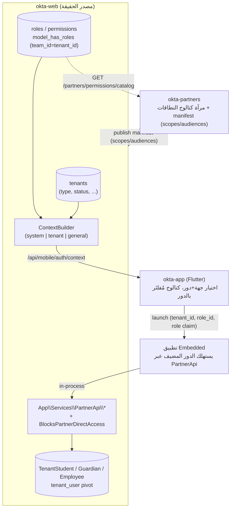

# المرجع التقني — الأدوار والكيانات (roles-and-entities · tech)

هذا المجلد هو **الطبقة التقنية** المقابِلة لمجلد
[`roles-and-entities/`](../README.md). الملفات المجاورة (`tenants.md`،
`end-users.md`، `role-hierarchy.md`) تصف الأنواع والأدوار والعلاقات **مفاهيميًا**؛
هذا المجلد يشرح **كيف تُترجَم تلك المفاهيم إلى كود** عبر منصة أوكتا المتكاملة:
الجداول، النماذج، الـ traits، الـ middleware، والجسور بين المستودعات الأربعة.

> القاعدة الذهبية: **`okta-web` هو مصدر الحقيقة** لكلٍّ من الكيانات (Tenants)
> والأدوار والصلاحيات. كل ما عداه (`okta-partners`، `okta-app`، وتطبيقات
> Embedded) **يستهلك** هذا النموذج أو **يعكسه**، ولا يخترعه.

---

## المحتوى

| الملف | يغطّي |
|---|---|
| [`entities-tenancy.md`](entities-tenancy.md) | كيف يُمثَّل **الكيان (Tenant / نوع الحساب)** تقنيًا: جدول `tenants`، عمود `type`، تعدّد المستأجرين (multitenancy)، ولماذا لا يوجد احتواء مفروض في القاعدة. |
| [`roles-rbac.md`](roles-rbac.md) | نظام **RBAC** المعتمِد على `spatie/laravel-permission` مع Teams: ربط `team_id ↔ tenant_id`، الأدوار الكنسيّة (`superadmin`/`tenant-admin`/`guardian`/`student`…)، واشتقاق الأدوار بالتفويض. |
| [`context-and-switching.md`](context-and-switching.md) | **السياق (Context)**: كيف يختار المستخدم جهةً + دورًا، خدمة `ContextBuilder`، الـ middleware الحارسة، ومسار السياق على الموبايل (`/api/mobile/auth/context`). |
| [`partner-apps-and-roles.md`](partner-apps-and-roles.md) | كيف ترى **تطبيقات الشركاء** (Embedded/External) الكياناتِ والأدوار: النطاقات (scopes)، `ModuleContext`، الجسر، عزل البيانات، وتمرير الدور للموبايل — مع مثال تطبيق Embedded. |
| [`web-partners-drift.md`](web-partners-drift.md) | **انحرافات web ↔ partners** في كتالوج الجهات/الأدوار (مفتاح «شركة تعليمية»، غياب روضة، أدوار audiences غير مضمونة، مزامنة بلا webhook) — والتكامل المطلوب. |

---

## الصورة عبر المستودعات (Cross-repo)

«الأدوار والكيانات» ليست خدمةً واحدة، بل **عقدٌ مشترك** تتقاسمه أربعة مستودعات:

| المستودع | دوره في الأدوار/الكيانات |
|---|---|
| **okta-web** | يملك جدول `tenants` + جداول `spatie` (roles/permissions/model_has_roles) + نماذج العضوية (`TenantStudent`/`TenantGuardian`/`TenantEmployee`). يبني السياق (`ContextBuilder`) ويفرض العزل. **مصدر الحقيقة.** |
| **okta-partners** | يعكس **كتالوج النطاقات** فقط (مرآة من okta-web). لا يملك طلابًا/أدوارًا لجهات تعليمية؛ كياناته (`tenants`) هي **حسابات الشركاء**، لا الجهات. يصف أيّ نطاقات/جماهير (audiences) يطلبها التطبيق. |
| **okta-app** | عميل Flutter: يقرأ قائمة **الجهات + الأدوار** المتاحة للمستخدم عبر `/api/mobile/auth/context`، ويخزّن السياق المختار، ويطلب كتالوج التطبيقات **المُفلتَر بالدور خادِميًّا**. |
| **تطبيق Embedded (مثال)** | يُشحَن ككود داخل okta-web؛ لا يعرّف أدوارًا خاصة، بل يستهلك دور المستخدم المضيف (staff مقابل guardian) ويصل لبيانات الجهة **حصرًا** عبر `App\Services\PartnerApi\*`. |

---

## المفاهيم ↔ التحقيق التقني (خريطة سريعة)

| المفهوم (في `roles-and-entities/`) | أين يعيش تقنيًا |
|---|---|
| نوع الكيان (شركة/مجمع/جامعة/كلية/مدرسة/معهد/أكاديمية/معلم فردي) | عمود `tenants.type` (string مسطّح) — [`entities-tenancy.md`](entities-tenancy.md) |
| الاحتواء (شركة → مجمع → مدرسة …) | منفَّذ كـ `tenants.parent_tenant_id` (adjacency list) + قواعد `EntityType` + خدمة `SetTenantParent` (ربط إداري) — [`entities-tenancy.md`](entities-tenancy.md#الاحتواء) |
| مسؤول الحساب | دور `tenant-admin` (scope=`tenant`) — [`roles-rbac.md`](roles-rbac.md) |
| إداري / معلم / طالب / ولي أمر | أدوار + نماذج عضوية (`TenantEmployee.type`, `TenantStudent`, `TenantGuardian`) — [`roles-rbac.md`](roles-rbac.md) |
| مفوّض ولي أمر | اشتقاق بالتفويض (مفاهيمي؛ حالة التحقيق موضّحة) — [`roles-rbac.md`](roles-rbac.md#الاشتقاق) |
| متابعة ولي أمر ← طالب | pivot `tenant_guardian_student` — [`roles-rbac.md`](roles-rbac.md) |
| التبديل بين جهة ودور | `ContextBuilder` + جلسة `context` — [`context-and-switching.md`](context-and-switching.md) |

> هذه الطبقة التقنية تكمّل أدلّة الخدمات ذات الصلة:
> [`role-based-access-control`](../../services/role-based-access-control/guide/README.md)،
> و[`tenant-members-management`](../../services/tenant-members-management/tech/architecture.md)،
> و[`tenant-registration`](../../services/tenant-registration/tech/README.md).

> ملاحظة للمحرّرين: أسماء الأدوار (`tenant-admin`/`guardian`/`student`) وقيم
> `tenants.type` و**أسماء النطاقات** (`education.students.read` …) كلها أجزاء من
> عقد بين المستودعات؛ تغييرها قد **يكسر** okta-partners/okta-app وتطبيقات
> Embedded المنشورة. عامِل أي تغيير عليها كـ breaking.
