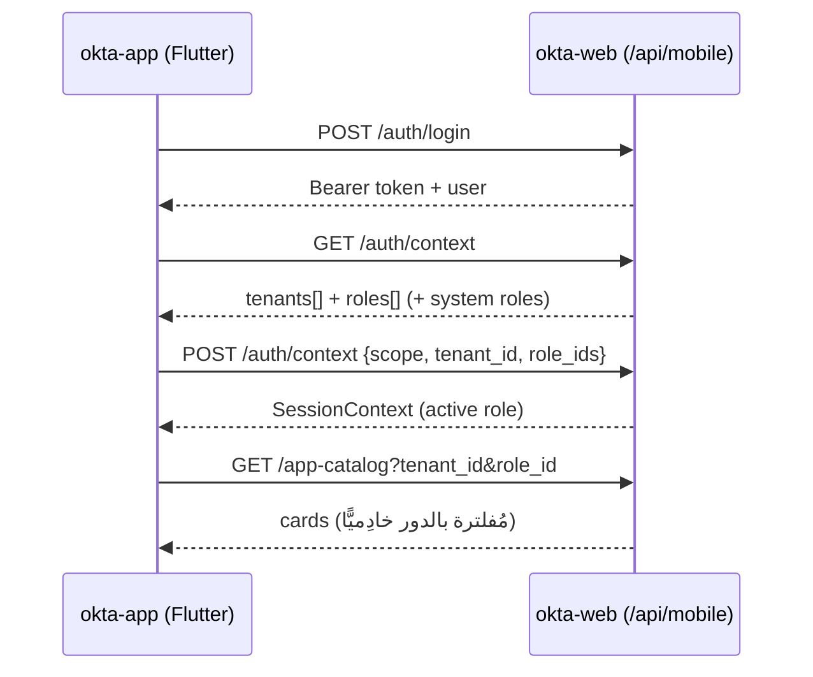

# السياق والتبديل بين جهة ودور (Context & Switching) — تقنيًا

مستخدم واحد قد يكون **مسؤول حساب** في مدرسة، و**معلمًا** في أخرى، و**ولي أمر** في
ثالثة. «السياق» هو الآلية التي يحدّد بها المستخدم **أيّ جهة + أيّ دور** يعمل ضمنه
الآن. يعيش هذا المنطق في `okta-web` ويُكشَف للموبايل عبر `/api/mobile/auth/*`.

---

## 1) أنواع السياق

| السياق | `scope` | `tenant_id` | الأدوار النشطة | حالات الاستخدام |
|---|---|---|---|---|
| **النظام** | `system` | NULL | أدوار `system` (`superadmin`/`platform-admin`/`finance-admin`) | إدارة المنصّة. |
| **الجهة** | `tenant` | معرّف الجهة | أدوار الجهة (`tenant-admin`, …) | لوحات إدارة المدرسة/الكلية. |
| **عام** | `general` | NULL | `guardian` / `student` | ولي أمر/طالب يتابع عبر كل جهاته. |

---

## 2) خدمة `ContextBuilder`

- **الملف**: `app/Services/ContextBuilder.php`.
- يبني السياق اعتمادًا على اختيارات محفوظة في **الجلسة**، ويكتب مفتاح `context`.

المسارات الثلاثة داخل الخدمة:

1. **`build(User $user)`** — يقرّر بين سياق النظام والجهة:
   - إن **لم** يكن `selected_tenant_user_id` في الجلسة ⟶ **سياق نظام**:
     `Tenant::forgetCurrent()` ثم جمع أدوار `scope = system`
     (مُقيَّدةً بـ `selected_system_role_ids` إن وُجدت).
   - إن وُجد `selected_tenant_id` + `selected_tenant_user_id` ⟶ **سياق جهة**:
     `$tenant->makeCurrent()` (يُشغّل `SyncPermissionTeamTask`)، ثم جمع الأدوار
     غير النظامية المختارة (`selected_role_ids`).
2. **`buildStudentContext(User $user)`** — سياق عام للطالب:
   `Tenant::forgetCurrent()`، `active_role_key = 'student'`, `scope = 'general'`.
3. **`buildGuardianContext(User $user)`** — سياق عام لولي الأمر:
   `active_role_key = 'guardian'`, `scope = 'general'`.

شكل المفتاح المخزَّن في الجلسة (مختصر):

```php
session(['context' => [
    'scope'            => 'tenant',           // system | tenant | general
    'tenant_id'        => $tenantId,          // null في system/general
    'tenant_user_id'   => $tenantUserId,
    'role_ids'         => [...],
    'active_role_id'   => $id,
    'active_role_name' => $name,
    'active_role_key'  => 'tenant-admin',     // اسم مُسلَّج للاستهلاك
]]);
```

> **مسح كاش الصلاحيات**: عند تغيير الجهة يجب استدعاء
> `PermissionRegistrar::forgetCachedPermissions()` حتى تُحتسب صلاحيات الجهة
> الجديدة (راجع
> [`06-context-role-switching.md`](../../services/role-based-access-control/guide/06-context-role-switching.md)).

---

## 3) Middleware الحارسة (الويب)

| Middleware | يضمن |
|---|---|
| `EnsureContext` | وجود سياق نشط؛ وإلا يعيد التوجيه لصفحة اختيار السياق (`/auth/context`). |
| `EnsureActiveTenantContext` | صلاحية سياق الجهة: الجهة نشطة وغير محذوفة، و`tenant_user` صالح. |
| `EnsureActiveRoles` | وجود أدوار نشطة في السياق. |

تفصيلها في دليل
[`07-middleware.md`](../../services/role-based-access-control/guide/07-middleware.md).

---

## 4) السياق على الموبايل (`/api/mobile/*`)

`okta-app` (عميل Flutter) **لا** يحمل جلسة ويب؛ بل يطلب القوائم ويختار السياق عبر
API ثم يخزّنه محليًّا. النقاط في okta-web:

- **Routes**: `routes/api.php` — مجموعتا `mobile/auth` و`mobile/*`
  (مع `auth:sanctum` + `mobile.min-version`).
- **Controllers**:
  `app/Http/Controllers/Api/Mobile/MobileAuthController.php`،
  و`MobileContextController.php`، و`MobileAppCatalogController.php`.

التدفّق:

| النقطة | الغرض |
|---|---|
| `POST /api/mobile/auth/login` | دخول بمعرّف (username/email/phone/national_id) + كلمة مرور ⟶ Bearer token. |
| `GET  /api/mobile/auth/context` | **قائمة الجهات + أدوار المستخدم في كلٍّ منها** (+ أدوار النظام إن وُجدت). |
| `POST /api/mobile/auth/context` | اختيار `scope` + `tenant_id` + `role_ids` ⟶ يُرجِع `SessionContext`. |
| `GET  /api/mobile/app-catalog?tenant_id&role_id` | كتالوج التطبيقات المُفلتَر بالدور (انظر [`partner-apps-and-roles.md`](partner-apps-and-roles.md)). |

على جانب Flutter (مرجع، للتوضيح):

- النماذج: `TenantOption { id, name, type, logo, roles[] }`،
  `RoleOption { id, name }`، و`SessionContext { scope, tenantId, activeRoleId, … }`
  في `lib/features/auth/data/auth_models.dart`.
- يُخزَّن `SessionContext` في التخزين الآمن
  (`lib/core/storage/secure_store.dart`)، وتُعاد قراءته عند الإقلاع. آلة الحالة:
  `unknown → unauthenticated → needsContext → authenticated`
  (`lib/features/auth/application/auth_controller.dart`).
- تبديل الجهة/الدور = إعادة اختيار من شاشة `tenant_select` ثم `role_select`، ما
  يُحدِّث `SessionContext` ويُعيد تحميل الكتالوج تلقائيًا (provider يراقب السياق).



---

## 5) لماذا «العام» منفصل عن «الجهة»؟

ولي الأمر/الطالب غالبًا مرتبطٌ بـ **عدّة جهات** (أبناء في مدارس مختلفة، أو طالب في
أكثر من جهة). سياق `general` يتجنّب إجبارهم على اختيار جهة واحدة: الدور يتبع
المستخدمَ، والاستعلامات تُجمَّع عبر الجهات المرتبطة (عبر `tenant_guardian_student`
و`tenant_students`). أما `tenant-admin`/الموظفون فيعملون دائمًا ضمن **جهة واحدة
نشطة** لأن صلاحياتهم مُقيَّدة بـ `team_id` لتلك الجهة.

---

## مراجع

- الأدوار والجداول: [`roles-rbac.md`](roles-rbac.md)
- الكيانات/المستأجرون: [`entities-tenancy.md`](entities-tenancy.md)
- دليل التبديل على مستوى الخدمة: [`06-context-role-switching.md`](../../services/role-based-access-control/guide/06-context-role-switching.md)
