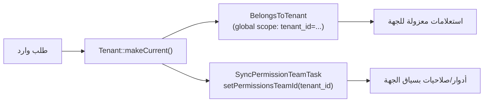

# الكيانات وتعدّد المستأجرين (Entities & Tenancy) — تقنيًا

كيف يتحوّل **«نوع الحساب / الكيان»** الموصوف في [`tenants.md`](../tenants.md) إلى
كود داخل `okta-web`، وكيف يُعزَل كل مستأجر عن غيره.

---

## 1) جدول `tenants` ونموذج `Tenant`

الكيان (Tenant) هو الصفّ الجذري لكل جهة مشتركة في المنصّة.

- **Migration**: `database/migrations/2026_02_08_110911_create_tenants_table.php`
- **Model**: `app/Models/Tenant.php` — يمدّد `Spatie\Multitenancy\Models\Tenant`
  (عبر `BaseTenant`)، ويستخدم `HasUlid`, `SoftDeletes`.

أبرز الأعمدة:

| العمود | النوع | الدور |
|---|---|---|
| `id` | bigint PK | المفتاح الداخلي. |
| `type` | string | **نوع الكيان** (انظر القسم 2). |
| `name` / `slug` | string | الاسم + معرّف URL فريد (يُولَّد آليًا). |
| `ulid` | string | معرّف عام ثابت — يُستخدَم كمفتاح ربط للجسر مع الشركاء. |
| `country_id` / `education_level_group_id` | FK | ربط الكيان ببيانات الدولة والمراحل (من خدمة إدارة الدول). |
| `status` | string | `active` \| `suspended` (راجع `Active()` scope). |
| `is_sandbox` | bool | تمييز جهات بيئة الـ sandbox. |
| `owner_partner_tenant_id` | FK nullable | ملكية شريك للجهة (سياق الشركاء)، **ليست** احتواءً تعليميًّا. |
| `registration_custom_fields` | json | لقطة من إجابات معالج التسجيل. |
| `deleted_at` | timestamptz | حذف ناعم. |

> العضوية والأدوار **لا** تعيش هنا؛ المستخدمون يرتبطون بالكيان عبر pivot
> `tenant_user` ونماذج العضوية (راجع [`roles-rbac.md`](roles-rbac.md)).

---

## 2) نوع الكيان (`type`) — قائمة مسطّحة، لا شجرة

نوع الحساب يُخزَّن كـ **string مسطّح** في `tenants.type`. القيم التي يصفها
[`tenants.md`](../tenants.md) تُمثَّل جميعها كقيم لهذا العمود الواحد.

**المصدر الكنسي للأنواع** هو ثابت
`App\Services\CountriesManagement\EntityRegistrationCustomizations\GetSettings::ENTITY_TYPES`
(مفاتيح `snake_case` ↔ تسميات عربية):

```php
'individual_teacher' => 'معلم فردي',   'school'           => 'مدرسة',
'complex'            => 'مجمع',         'college'          => 'كلية',
'university'         => 'جامعة',        'institute'        => 'معهد',
'academy'            => 'أكاديمية',     'education_company' => 'شركة تعليمية',
```

- **لا قيد enum/check على مستوى القاعدة**؛ التحقّق يتم في طبقة التطبيق:
  `RegisterTenant::validateTenantData()` يرفض أي نوع ليس مفتاحًا في
  `GetSettings::ENTITY_TYPES`. لكل دولة يمكن **تمكين/تعطيل** مجموعة فرعية عبر
  `GetEntityRegistrationCustomization`.
- بعض الأنواع تتطلّب اختيار مرحلة تعليمية عند التسجيل — يحدّدها
  `EntityTypesRequiringEducationLevel::KEYS = ['school', 'individual_teacher']`.
- **حذار من القوائم القديمة المكرّرة**: تعليق الـ migration و`SubjectModal`
  وبعض الـ presenters/blade تحمل قائمة قديمة فيها `kindergarten` (وهي **مرحلة
  تعليمية** لا نوع كيان) وتُسقِط `complex`/`education_company`/`individual_teacher`.
  اعتمد دائمًا `GetSettings::ENTITY_TYPES`.
- التمييز بين «جهة تشغيلية» و«حاوية» (انظر [`role-hierarchy.md`](../role-hierarchy.md))
  هو تمييز **مفاهيمي/منطقي**، لا ينعكس على بنية الجدول.

### الاحتواء

العلاقة «شركة تعليمية → مجمع → مدرسة» و«جامعة → كلية» الموصوفة في
[`role-hierarchy.md`](../role-hierarchy.md) هي **نموذج عمل (business model)**؛
وهي **غير مفروضة كـ `parent_id`/شجرة في `tenants`**. تقنيًا:

- جدول `tenants` **مسطّح** — لا عمود `parent_tenant_id` ولا nested-set.
- العمود الوحيد ذو دلالة «ملكية» هو `owner_partner_tenant_id`، وهو يربط الجهة
  بـ **حساب شريك** في سياق منصّة الشركاء، لا بجهةٍ تعليميةٍ أكبر.

> خلاصة للمحرّر: عند الحاجة لتمثيل الاحتواء التعليمي مستقبلًا، سيتطلب ذلك جدول/عمود
> جديدًا؛ لا تفترض وجوده اليوم في الكود.

---

## 3) تعدّد المستأجرين (Multitenancy)

المنصّة تستخدم `spatie/laravel-multitenancy 4` بنمط **قاعدة بيانات واحدة
مُفلتَرة حسب المستأجر** (single DB, scoped) — لا قاعدة بيانات منفصلة لكل جهة.

### المستأجر الحالي

- `Tenant::makeCurrent()` يضبط الجهة النشطة للطلب.
- `Tenant::forgetCurrent()` يلغيها (سياق النظام/العام).
- `Tenant::current()` يُرجِع الجهة النشطة.

### الفلترة التلقائية: `BelongsToTenant`

- **Trait**: `app/Models/Concerns/BelongsToTenant.php`.
- يضيف **global scope** يحقن `where tenant_id = Tenant::current()` على كل استعلام،
  ويملأ `tenant_id` تلقائيًا عند الإنشاء.
- للتجاوز المتعمَّد: `Model::withoutTenantScope()`.

### مزامنة سياق الصلاحيات مع المستأجر

عند `makeCurrent()`، تعمل مهمّة ضمن سلسلة مهام spatie:

- **`app/Multitenancy/Tasks/SyncPermissionTeamTask.php`** تستدعي
  `PermissionRegistrar::setPermissionsTeamId($tenant->getKey())`.

أي أنّ **معرّف الـ team في spatie/laravel-permission = `tenant_id`**. هذا هو
الجسر الذي يجعل أدوار المستخدم تُقيَّم ضمن سياق الجهة الحالية تلقائيًا — تفاصيله في
[`roles-rbac.md`](roles-rbac.md).



---

## 4) `PartnerTenant` — مرآة قراءة فقط لقاعدة الشركاء

داخل okta-web يوجد نموذج **`app/Models/PartnerTenant.php`** على اتصال `partners`
(قاعدة بيانات okta-partners، خادم منفصل). هو **مرآة للقراءة فقط** لبيانات الشريك
(المطوّر) — يُستخدَم مثلًا في `Module.partner`.

ميِّز بوضوح:

- **`Tenant`** (في okta-web) = **جهة تعليمية** (مدرسة/جامعة…) ولها طلاب وموظفون
  وأدوار.
- **`PartnerTenant`** = **حساب شريك/مطوّر** يؤلّف التطبيقات. لا يملك طلابًا ولا أدوار
  مستخدم نهائي.

نظير ذلك على الجانب الآخر: جدول `tenants` داخل **okta-partners** يمثّل **الشركاء**،
وله عمود `okta_tenant_ref` للربط بكيان okta-web عند الحاجة (راجع
[`partner-apps-and-roles.md`](partner-apps-and-roles.md)).

---

## 5) تثبيت التطبيقات على الكيان

ربط «جهة ← تطبيق مثبَّت» يعيش في:

- **Migration/Model**: `tenant_module_installations` ←→ `app/Models/TenantModuleInstallation.php`.
- أعمدة: `tenant_id`, `module_id`, `status` (`active`/`inactive`),
  `approved_permissions` (json — النطاقات الممنوحة)، `installed_at`.
- وصول: `$tenant->moduleInstallations()`.

هذا الجدول هو المنطلق لإصدار **رمز التثبيت** (`PartnerInstallationToken`) الذي
يستخدمه التطبيق للوصول لبيانات الجهة ضمن النطاقات الممنوحة — تفاصيله في
[`partner-apps-and-roles.md`](partner-apps-and-roles.md).

---

## مراجع

- المفاهيم: [`tenants.md`](../tenants.md) · [`role-hierarchy.md`](../role-hierarchy.md)
- التسجيل والنماذج: [`tenant-registration/tech`](../../services/tenant-registration/tech/README.md)
- العضوية: [`tenant-members-management/tech`](../../services/tenant-members-management/tech/architecture.md)
