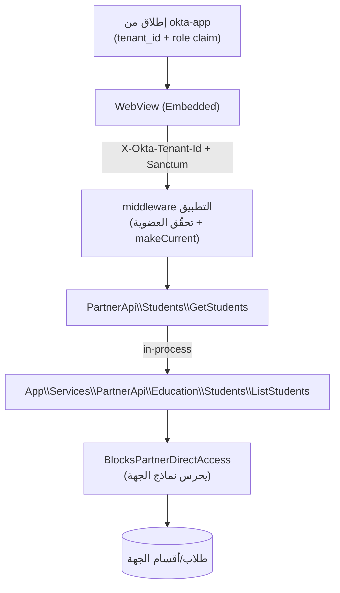

# تطبيقات الشركاء، الكيانات، والأدوار — تقنيًا

كيف ترى **التطبيقات المثبَّتة** (المؤلَّفة عبر `okta-partners`) كيانَ الجهة ودورَ
المستخدم — دون أن تخترق عزل `okta-web`. هذا الملف يربط المستودعات الأربعة في مسار
واحد: تعريف النطاق ⟶ نشره ⟶ تثبيته ⟶ استهلاكه وقت التشغيل (ويب وموبايل)، مع **مثال
تطبيق Embedded**.

> خلفية أوسع عن الجسر ودورة dev→prod:
> [`claude/partners.md`](../../../claude/partners.md) ·
> [`claude/installed-apps.md`](../../../claude/installed-apps.md) ·
> [`claude/deployment.md`](../../../claude/deployment.md).

---

## 1) العملة المشتركة: النطاقات (Scopes)

التطبيقات لا تطلب «أدوارًا»؛ تطلب **نطاقات** على موارد الجهة بصيغة
`<feature>.<resource>.<action>`. الأفعال للشركاء **`read` و`write` فقط** (لا حذف).

أمثلة ذات صلة بالأدوار/الكيانات:
`education.students.read`, `education.students.write`,
`education.guardians.read`, `education.sections.read`,
`education.academic_years.read`, `employees.directory.read`.

- **مصدر الحقيقة** في okta-web: `App\Services\PartnerScopes\Catalog\RegisterScope`،
  ويُسرَد عبر `GetCatalog`/`GetCatalogHash`، ويُكشَف على:
  - `GET /api/partners/permissions/catalog` (الكتالوج الكامل)
  - `GET /api/partners/permissions/catalog/hash` (drift detection)
- النموذج المحلي: `app/Models/PartnerScope.php` (جدول `partner_scopes`).

### المرآة في okta-partners

okta-partners **يعكس** الكتالوج ولا يخترعه:

- `App\Services\PartnerScopes\Catalog\SyncFromOktaWeb` يسحب الكتالوج
  (hash-aware) إلى جدول `partner_available_scopes`.
- محفِّزات: cron (`partners:sync-scope-catalog`)، أو webhook
  `partner_scopes.catalog.changed`، أو `--force`.
- `GetGroupedCatalog` يُجمّعه للـ UI: `feature → resource → actions`.

---

## 2) إعلان التطبيق عن حاجته (manifest)

في okta-partners يختار الشريك مستوى وصول لكل resource عبر picker واحد
(`<x-permissions-grid>` + trait `ManagesModuleScopes`): **لا شيء / قراءة / قراءة
وكتابة**. تُترجَم إلى مصفوفة نطاقات تُخزَّن في عمود `scopes` (JSON) على
`partner_modules` و`partner_module_versions`، وتُصدَّر في الـ manifest:

```json
"scopes": [
  { "key": "education.students.read",  "required": true },
  { "key": "education.students.write", "required": true }
]
```

### الجماهير (Audiences) — الربط بالأدوار/البوابات

إضافةً للنطاقات، يصرّح إصدار التطبيق بـ **audiences** (عمود `audiences` على
`partner_module_versions`) تُحدِّد **لِمن يظهر** التطبيق وأين:

- `target = "portal"` ⟶ بوابة طالب/ولي أمر (`portal: student|guardian`).
- `target = "role"` ⟶ دور محدّد (مثل `tenant-admin`).
- لكل جمهور `web_route` (سطح okta-web) و`mobile_entry` (مدخل الموبايل).

منها تُبنى كتل `menu.audiences[]` و`mobile.audiences[]` في الـ manifest — وهي ما
يعتمده okta-web وokta-app لتقرير ظهور التطبيق **حسب الدور**.

### نوع التكامل (Integration Type)

`app/Enums/IntegrationType.php`: **Embedded** (يُشحَن ككود داخل okta-web)،
**External** (مستضاف لدى الشريك، HTTP + webhooks)، **Notification** (مزوّد إشعارات).
النوع يحدّد **كيف** يصل التطبيق لبيانات الجهة، لا **ماذا** يصل (النطاقات هي التي
تحدّد ذلك):

| النوع | كيف يصل للبيانات | المصادقة |
|---|---|---|
| Embedded | استدعاء **داخل العملية (in-process)** لـ `App\Services\PartnerApi\*` | سياق التثبيت (`ModuleContext`) |
| External | HTTP فوق سطح الشركاء + webhooks موقَّعة | `PartnerInstallationToken` / API key |

---

## 3) التثبيت ووقت التشغيل في okta-web

عند تثبيت تطبيق على جهة، تُنشأ صفّ في `tenant_module_installations` ويُصدَر **رمز
تثبيت** يحمل النطاقات الممنوحة. مكوّنات الـ runtime:

- **`PartnerInstallationToken`** — bearer مرتبط بـ (tenant, module) + `scopes`
  + صلاحية/إبطال.
- **`ModuleContext`** (DTO، `app/Support/PartnerScopes/ModuleContext.php`) يحمل:
  `tenantId`, `moduleId`, `moduleSlug`, `installationId`, `grantedScopes[]`,
  `dbConnectionName?` — مع `hasScope()`.
- **`AppContextManager`** (singleton) يحمل `ModuleContext` للطلب الحالي.

### الحُرّاس (Guards)

- **`auth.app`** (`AuthenticateAppInstallation`): يتحقّق من Bearer، يحلّ التثبيت،
  يبني `ModuleContext`، ويضعه في `AppContextManager`.
- **`app.scope:<key>`** (`EnsureAppScope`): يرفض 403 إن لم يكن النطاق ممنوحًا.
- **`BlocksPartnerDirectAccess`** (trait على `TenantStudent`/`TenantGuardian`/
  `TenantEmployee`/…): يرمي استثناءً إن حاول كود من خارج `App\Services\PartnerApi\*`
  لمس النموذج وسياق partner نشط. هذا يضمن أن التطبيق يرى الكيان/الطلاب **فقط** عبر
  السطح المصرَّح.

> كل سطح الـ Partner-app runtime يعيش في `routes/apps.php`؛ كل route يحدّد
> `app.scope:<...>` ويُفوِّض إلى service تحت `App\Services\PartnerApi\*` لا يلمس
> Eloquent مباشرة.

---

## 4) من أين يأتي «الدور» للتطبيق؟

تطبيقات الشركاء **لا تعرّف أدوارًا خاصة**؛ تستهلك دور المستخدم المضيف:

- **ويب (Embedded)**: تعمل ضمن سياق okta-web نفسه؛ الجهة الحالية والدور متاحان عبر
  middleware المنصّة (`context`/`active-tenant-context`)، و`Tenant::current()`
  مضبوطة.
- **موبايل**: عند الإطلاق من okta-app، يُمرَّر **مطالبة الدور (role claim)** إذا
  ضبط الـ manifest `passRoleClaim: true` — JWT قصير العمر يحمل اسم الدور النشط فقط
  (لا اعتمادات منصّة). كما تُمرَّر `tenant_id` و`role_id`.

على جانب okta-app: الكتالوج يُفلتَر **خادِميًّا** — okta-web يحذف البطاقة قبل
إرسالها إن كان الدور لا يستوفي `required_scope`/audience، فالعميل لا يستلم بطاقةً لا
يحقّ له رؤيتها (`AppCatalogCard { requiredScope, passRoleClaim, mode, entry }`).

---

## 5) مثال: تطبيق Embedded يقرأ الكيان والأدوار

نأخذ تطبيق **Embedded** حقيقيًّا كنموذج (تطبيق متابعة حضور/استئذان الطلاب). يوضّح
العقد كاملًا دون أيّ وصول مباشر لداخليّات okta-web:

**(أ) الـ manifest** يعلن `integrationType: "embedded"` ونطاقات على بيانات الجهة:

```json
{
  "integrationType": "embedded",
  "mobile": { "supported": true, "mode": "webview", "passRoleClaim": true,
              "allowedRoles": ["tenant-admin"] },
  "scopes": [
    { "key": "education.students.read",        "required": true },
    { "key": "education.students.write",       "required": true },
    { "key": "education.academic_years.read",  "required": true },
    { "key": "education.terms.read",           "required": true },
    { "key": "education.sections.read",        "required": true }
  ]
}
```

**(ب) الوصول للبيانات حصرًا عبر `PartnerApi`**: التطبيق يلفّ نداءاته في خدمات مثل
`PartnerApi\Students\GetStudents` التي تستدعي صنف المنصّة
`App\Services\PartnerApi\Education\Students\ListStudents` — ولا يستورد نماذج
`App\Models\*` أبدًا (يفرض ذلك ماسح السياسة، القسم 6).

**(ج) من أين يعرف الجهة والدور؟**

- **ويب**: مجموعة الـ routes خلف
  `['context','active-tenant-context','tenant.scope','module.access:<app>']`،
  فترث الجهة الحالية تلقائيًّا.
- **موبايل (WebView)**: عند الإطلاق، يُحقَن في صفحة الـ dashboard:
  `tenantId` (من رابط الإطلاق الموقَّع) + `role: { id, name }` (من role claim) +
  رمز Sanctum قصير العمر. وكل نداء API لاحق يحمل ترويسة `X-Okta-Tenant-Id`.
  middleware التطبيق يتحقّق أن المستخدم **عضو** في الجهة (`tenant_user`) قبل
  `Tenant::makeCurrent()` + `setPermissionsTeamId(tenantId)`.

**(د) البوّابة حسب الدور داخل التطبيق**: التطبيق يستنتج «موظف مقابل ولي أمر» من
اسم الدور المُمرَّر + استعلام «أبناء وليّ الأمر» عبر
`PartnerApi\...\ListStudentsForGuardian`:

- لو المستخدم **ولي أمر وليس موظفًا** ⟶ يُحصَر على أبنائه فقط (لا يرى/يقدّم طلبات
  لطالب غير مرتبط به).
- لو **موظف** ⟶ يرى طابور الاعتماد وكل الطلاب والتقارير.

أي أنّ **التطبيق لا يبني نظام أدوار**؛ يُسقِط منطقه على دور okta-web المضيف.

**(هـ) عزل البيانات**: التطبيق يكتب بياناته الخاصة (سجلات الحضور/الاستئذان) في
**schema/قاعدة معزولة** خاصة بالتثبيت، ويظلّ يقرأ بيانات الطلاب/الكيان من المنصّة
عبر `PartnerApi` فقط.



---

## 6) ماسح السياسة (boilerplate)

كل تطبيق Embedded يُولَّد من boilerplate الشركاء، ويحمل **ماسح سياسة** يمنع لمس
داخليّات okta-web:

- `scripts/partner-policy/Scanner.php` (regex، بوّابة CI صلبة) +
  قاعدة PHPStan (`PartnerInternalAccessRule`) المضبوطة في `phpstan.neon`
  بـ `moduleNamespace`/`moduleEnvPrefix`/`moduleConfigPrefix`.
- workflow `.github/workflows/partner-module-policy.yml` يشغّله على كل PR.
- يمنع: استيراد `App\Models\*`/`App\Services\*` (عدا `App\Services\PartnerApi\*`)،
  والاستعلامات الخام على جداول المنصّة، وقراءة `.env`/config الحسّاس.

هذا الماسح هو ما يجعل «الوصول للأدوار/الكيانات عبر `PartnerApi` فقط» قاعدةً
مفروضةً آليًّا، لا مجرّد اتفاق.

---

## مراجع

- النطاقات والجداول: [`roles-rbac.md`](roles-rbac.md) · [`entities-tenancy.md`](entities-tenancy.md)
- السياق والإطلاق على الموبايل: [`context-and-switching.md`](context-and-switching.md)
- منصّة الشركاء ودورة النشر: [`claude/partners.md`](../../../claude/partners.md) · [`claude/deployment.md`](../../../claude/deployment.md)
- عقد التطبيق المثبَّت: [`claude/installed-apps.md`](../../../claude/installed-apps.md)
