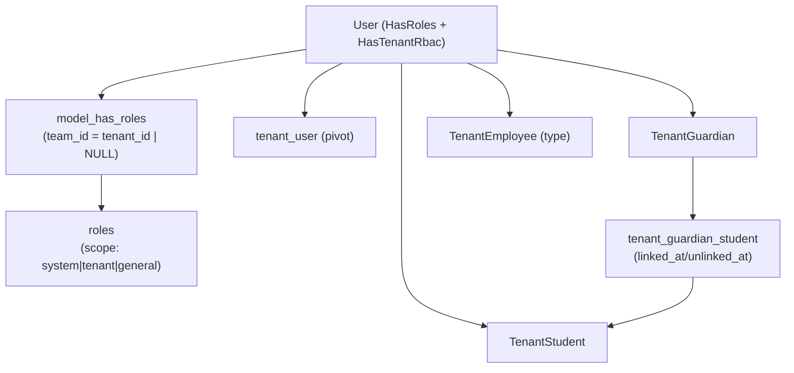

# الأدوار والصلاحيات (RBAC) — تقنيًا

كيف تتحوّل أدوار المستخدم النهائي في [`role-scopes.md`](../role-scopes.md) وعلاقات
[`role-hierarchy.md`](../role-hierarchy.md) إلى جداول ونماذج داخل `okta-web`.
الأساس: حزمة **`spatie/laravel-permission 6`** مع ميزة **Teams** مفعّلة.

> لخلفية على مستوى الخدمة (الواجهات، seeders، الـ middleware التفصيلية) راجع دليل
> [`role-based-access-control`](../../services/role-based-access-control/guide/README.md)
> وبنية القاعدة في [`00-database-structure.md`](../../services/role-based-access-control/guide/00-database-structure.md).

---

## 1) الجسر: `team_id ≡ tenant_id`

spatie تدعم «Teams» لتقييد الأدوار ضمن نطاق. في أوكتا **الـ team هو الجهة**:

- جداول `roles` و`model_has_roles` و`model_has_permissions` تحوي عمود `team_id`.
- عند تنشيط جهة (`Tenant::makeCurrent()`) تستدعي
  `SyncPermissionTeamTask` ⟵ `PermissionRegistrar::setPermissionsTeamId($tenantId)`،
  فتصبح كل عمليات `hasRole`/`can` مُقيَّدةً بأدوار تلك الجهة تلقائيًا.

نتيجةً لذلك:

- `model_has_roles.team_id = NULL` → دور على **مستوى النظام**.
- `model_has_roles.team_id = <tenant_id>` → دور على **مستوى الجهة**.

---

## 2) امتداد جداول spatie

أعمدة مُضافة فوق الحزمة (راجع
`database/migrations/2026_02_08_113849_extend_roles_table_for_tenancy.php`
و`2026_03_16_000001_add_team_id_to_permission_pivot_tables.php`):

**`roles`** — إضافات: `tenant_id` (FK nullable)، `scope`
(`system`\|`tenant`\|`general`)، `kind` (مُميِّز الأدوار المؤلَّفة في الجهة، مثل
`administrator_group`؛ الأدوار الكنسية `NULL`)، `title_ar`/`title_en` (اسم معروض)،
`deleted_at`. قيد فريد: `(tenant_id, name, guard_name)`. (`kind` + `title_*` من
migration `add_kind_and_titles_to_roles_table`.)

**`permissions`** — إضافات: `scope`، `tenant_id`، `title_ar`/`title_en`،
`deleted_at`.

**`model_has_roles`** — إضافات: `team_id` (نمط spatie) + `tenant_id` للأدوار على
مستوى الجهة، مع فهارس على `tenant_id` و`deleted_at`.

تسمية الصلاحيات تتبع معيار `<feature>.<resource>.<action>` (lowercase + dot +
snake_case) — راجع [`permissions-naming`](../../tech-standards/permissions-naming.md).

---

## 3) الأدوار الكنسيّة (Canonical roles)

| الدور | `scope` | `tenant_id` | يقابل في المفاهيم | مصدره في الكود |
|---|---|---|---|---|
| `superadmin` | `system` | NULL | — (مدير المنصّة) | `database/seeders/RoleSeeder.php` |
| `finance-admin` | `system` | NULL | — (المالية) | `RoleSeeder` |
| `tenant-admin` | `tenant` | لكل جهة | **مسؤول الحساب** | `RoleSeeder` (لكل جهة) |
| `guardian` | `general` | لكل جهة | **ولي أمر** | migration backfill `2026_06_04_000001_seed_guardian_role_and_backfill.php` |
| `student` | `general` | لكل جهة | **طالب** | migration backfill `2026_06_07_000001_seed_student_role_and_backfill.php` |
| (معلم) | — | — | **معلم** | عبر `TenantEmployee.type='teacher'` — انظر القسم 5 |

ملاحظات:

- `tenant-admin` هو التحقيق التقني لـ**مسؤول الحساب**: المالك المباشر للجهة، ويملك
  صلاحيات `users.*`, `roles.*`, `tenants.members.*`, `landing.*`, `notifications.*`.
- `guardian` و`student` بـ `scope='general'`: أدوار «شخصية» تتبع المستخدم عبر كل
  الجهات المرتبط بها، لا تتطلّب اختيار جهة واحدة (راجع السياق العام في
  [`context-and-switching.md`](context-and-switching.md)).
- migrations الـ backfill **تُنشئ الدور لكل جهة** ثم **تُسنده تلقائيًا** لكل صفّ غير
  مُحرَّر في `tenant_guardians`/`tenant_students`:

  ```sql
  INSERT INTO model_has_roles (role_id, model_id, model_type, tenant_id)
  VALUES (:roleId, :userId, 'App\Models\User', :tenantId);
  ```

---

## 4) النموذج `User` وواجهات RBAC داخل الجهة

`app/Models/User.php` يستخدم `HasRoles` (spatie) + `HasUlid` +
**`HasTenantRbac`** (`app/Models/Concerns/HasTenantRbac.php`). الأخير يوفّر فحوصًا
مرتبطة بجهة معيّنة دون الاعتماد على «الجهة الحالية» العامّة:

```php
$user->getRolesInTenant($tenant);            // يضبط team_id ثم يجلب الأدوار
$user->hasRoleInTenant('tenant-admin', $t);  // فحص دور داخل جهة
$user->canInTenant('users.update', $tenant); // فحص صلاحية مشتقّة من الأدوار
$user->isSuperAdmin();                        // دور system
```

ربط المستخدم بالجهة:

- pivot **`tenant_user`** (`app/Models/TenantUser.php`) — فريد `(tenant_id, user_id)`
  مع حذف ناعم. `TenantUser::roles()` يقرأ `model_has_roles` مُقيَّدًا بـ
  `tenant_id` ونوع `User` فقط.
- **الربط الإداري (مسؤول منصّة)** من `settings/users/{hashid}/edit`
  (`UserEditorPage`): بطاقة «وصول الجهات» تعرض جهات المستخدم وأدواره في كلٍّ،
  وزرّ **«إضافة جهة»** يفتح modal بحث (`UserTenantPickerModal`) لاختيار **جهة
  واحدة + أدوارها**. الكتابة الفعلية في خدمة
  `App\Services\Tenants\Members\AttachUserToTenant`: `TenantUser::firstOrCreate`
  ثم `syncRoles` ضمن سياق فريق الجهة (`setPermissionsTeamId($tenantId)`)، مع
  إسقاط أي دور ليس `scope='tenant'`. أمّا حفظ أدوار الجهات القائمة (المربّعات) +
  أدوار النظام فيمرّ عبر `App\Services\UserManagement\Roles\AssignUserRoles` عند
  حفظ الصفحة. محميّ بصلاحية `rbac.users.update`.

---

## 5) نماذج العضوية وعلاقاتها

العضوية «العمليّة» للمستخدم داخل الجهة تعيش في نماذج مستقلّة (لا في spatie وحده):

| النموذج | الجدول | يمثّل | علاقات |
|---|---|---|---|
| `TenantStudent` | `tenant_students` | **طالب** بالجهة | `grade()`, `section()`, `guardians()` |
| `TenantGuardian` | `tenant_guardians` | **ولي أمر** بالجهة | `students()` |
| `TenantEmployee` | `tenant_employees` | **موظف** (إداري/معلم) — التمييز عبر `type` | `user()` |

- كلها تستخدم `BelongsToTenant` + **`BlocksPartnerDirectAccess`** (تمنع وصول كود
  الشركاء المباشر — انظر [`partner-apps-and-roles.md`](partner-apps-and-roles.md)) +
  `HasUlid`/`HasHashid` + حذف ناعم.
- **علاقة المتابعة ولي أمر ← طالب** = pivot **`tenant_guardian_student`** مع
  `linked_at`/`unlinked_at` (فصل ناعم بلا حذف، لحفظ السجلّ التاريخي).
- **«معلم»** ليس دور spatie مزروعًا اليوم؛ يُمثَّل بـ `TenantEmployee.type='teacher'`.
  الصلاحيات الدقيقة للموظف تُمنح عبر إسناد دور/صلاحيات حسب النشر.

---

## 6) الاشتقاق بالتفويض (Role derivation)

العلاقتان «**مسؤول الحساب → إداري**» و«**ولي أمر → مفوّض ولي أمر**» الموصوفتان في
[`role-hierarchy.md`](../role-hierarchy.md#اشتقاق-الأدوار-بالصلاحيات) هما **اشتقاق
بمنح جزء من الصلاحيات**، لا إنشاء نوع مستقل:

- **مسؤول الحساب → إداري**: **مُنفَّذ** عبر **مجموعات `administrator`**. يؤلّف
  `tenant-admin` مجموعةً = دور `scope='tenant'` بـ `kind='administrator_group'`
  واسم تقني `administrator.<slug>` يحمل حزمة صلاحيات منتقاة. الخدمات:
  `App\Services\TenantRoles\AdministratorGroups\{Create,Update,Delete}AdministratorGroup`
  (trait `GuardsGrantablePermissions`). الصلاحيات: `roles.{view,create,update,delete}`
  بنطاق `tenant` (يملكها `tenant-admin`). **حارس منع التصعيد**: لا يمنح الدور إلا
  صلاحيات (أ) `scope='tenant'` و(ب) يملكها المؤلِّف فعلًا في الجهة
  (`getPermissionsInTenant`)، وإلا `PermissionEscalationException`. الواجهة:
  `settings/tenant/administrator-groups`. كل ذلك عبر جداول spatie القائمة (إسناد +
  فحوص `can` تعمل بلا منطق إضافي).
- **ولي أمر → مفوّض ولي أمر**: **مُنفَّذ** بتفويض مقيَّد بطلاب محدّدين. دور
  `guardian-delegate` (scope `general`، `kind='guardian_delegate'`) يُسنَد للمفوَّض،
  والتفويض نفسه في جدولين: `tenant_guardian_delegations` (المفوِّض/المفوَّض/الحالة/
  القدرات) + `tenant_guardian_delegation_student` (الطلاب المشمولون، فصل ناعم).
  الخدمات: `App\Services\GuardianDelegation\{Create,Update,Revoke}GuardianDelegation`
  + `ResolveDelegateUser` (دعوة: حلّ بمعرّف أو إنشاء مستخدم) + `AssignGuardianDelegateRole`
  + `GetDelegatedChildrenForUser`. **حارس النطاق** (`GuardsDelegableScope`): لا تفويض
  إلا على أبناء ولي الأمر النشطين وبقدرات من كتالوج `App\Support\GuardianCapabilities`،
  وإلا `DelegationScopeException`. البوابة: `/my-children/delegates`، و`GetGuardianPortal`
  يدمج الأبناء المفوَّضين. **تحسين مؤجَّل**: gating كل قدرة داخل الموديولز (الإطار يُنفِّذ
  تقييد الطلاب + ظهور البوابة + كتالوج القدرات اليوم).

---

## مخطط مبسّط



---

## مراجع

- المفاهيم: [`role-scopes.md`](../role-scopes.md) · [`role-hierarchy.md`](../role-hierarchy.md)
- المعيار: [`permissions-naming`](../../tech-standards/permissions-naming.md)
- الخدمة: [`role-based-access-control/guide`](../../services/role-based-access-control/guide/README.md)
- العضوية: [`tenant-members-management/tech/models`](../../services/tenant-members-management/tech/models/README.md)
